<div align="center">

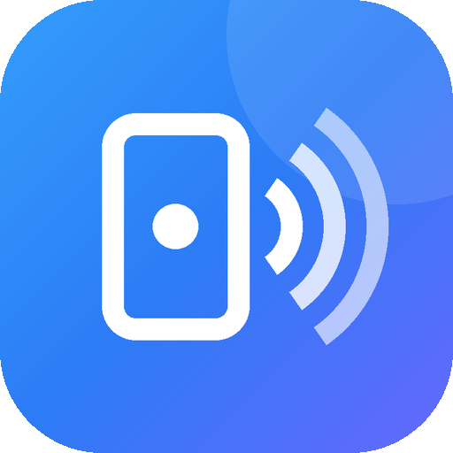

# MyNFC

**Read, write, save and export NFC tags — plus a raw RFID memory editor — with a UI that doesn't look like 2012.**


[](LICENSE)

</div>

MyNFC is an Android NFC toolkit built with Jetpack Compose. Tap a tag to see everything about it — chip type, UID, memory, and decoded NDEF records — then save it to your library, export it as JSON, or write a copy onto another tag. Compose links, contacts, Wi‑Fi credentials and more, and write them to any NDEF tag in one tap.

A separate **RFID** tab goes a level lower: it dumps a chip's raw memory block by block, shows it in a colour‑coded hex grid, and lets you edit any writable block or clone the whole tag.

No ads, no accounts, no network permission. Your data stays on your device.

## Screenshots

| Home | Scan | Tag details | Advanced info |
|:---:|:---:|:---:|:---:|
| 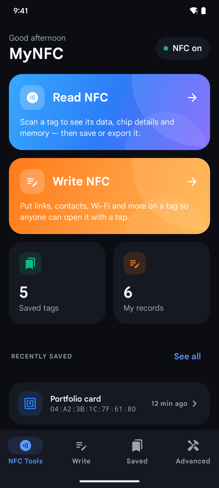 | 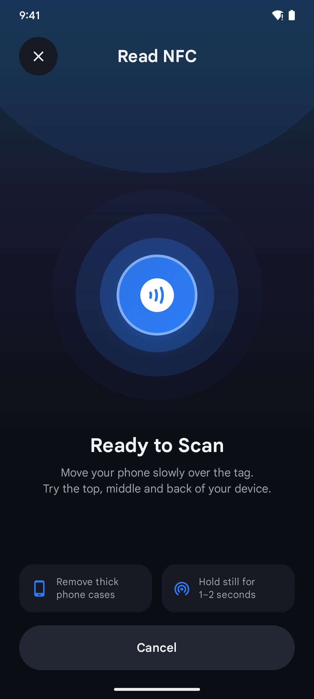 | 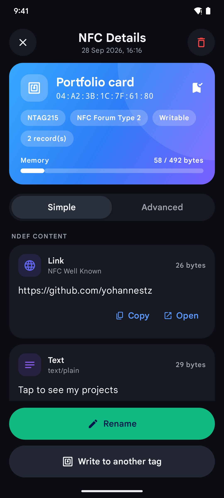 | 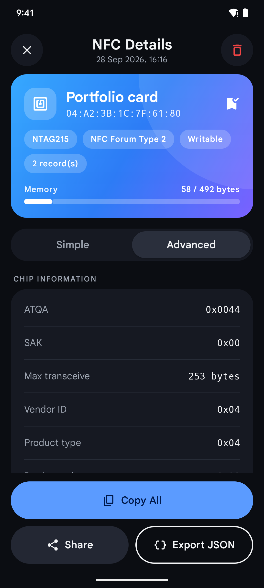 |

| Saved tags | Contact tag | My records | Add new record |
|:---:|:---:|:---:|:---:|
| 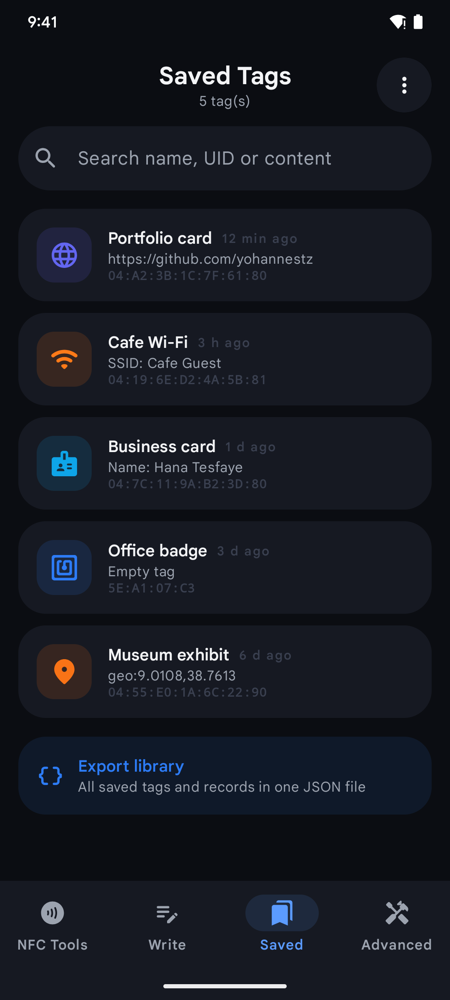 | 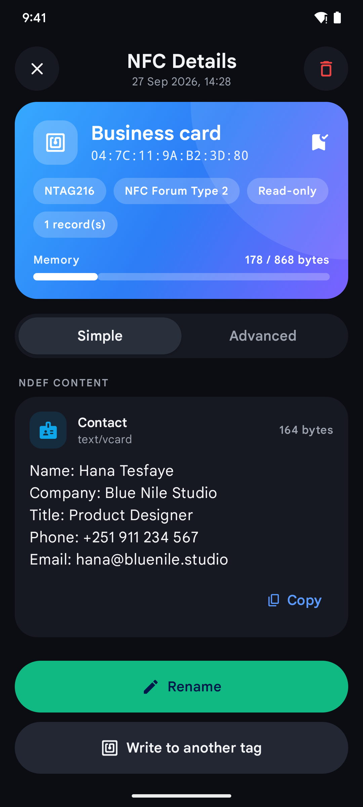 | 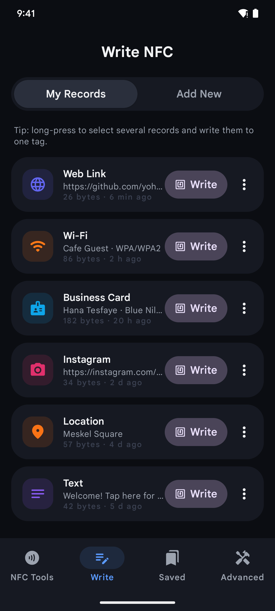 | 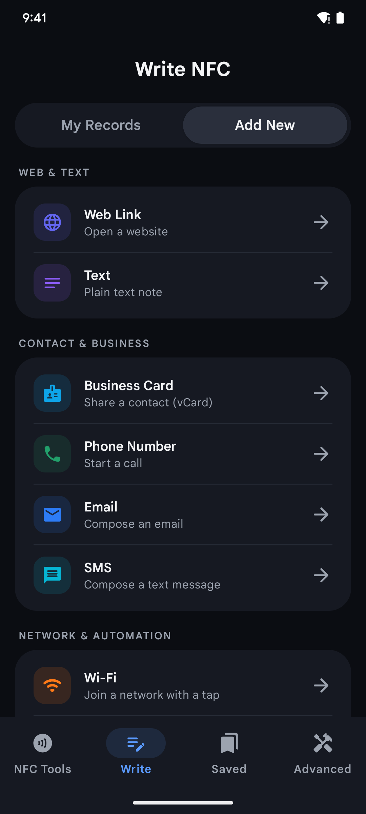 |

| Record editor | Writing to a tag | Tools | Light theme |
|:---:|:---:|:---:|:---:|
| 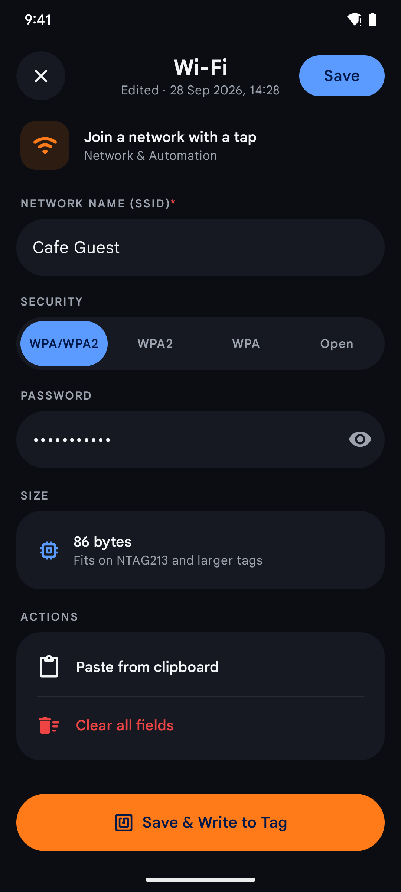 | 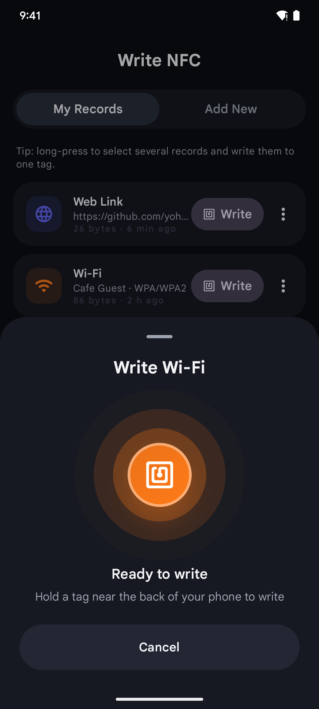 | 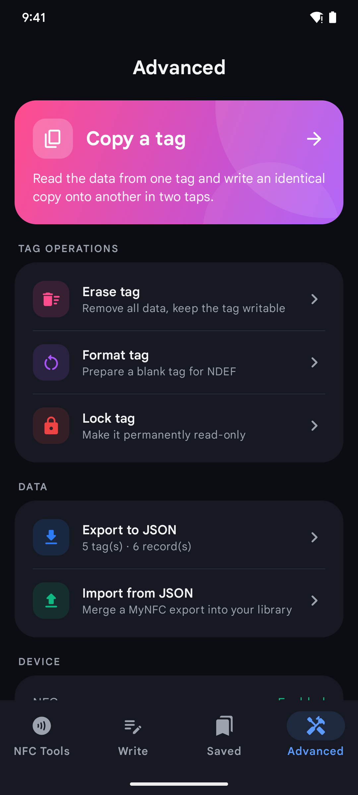 | 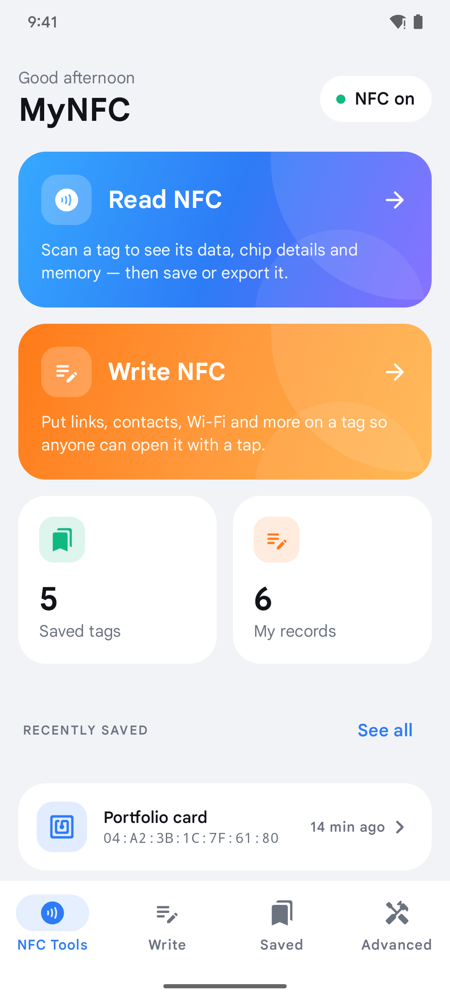 |

### RFID — raw memory

| Dumps | Tag memory | Memory grid | Hex editor | Restore |
|:---:|:---:|:---:|:---:|:---:|
| 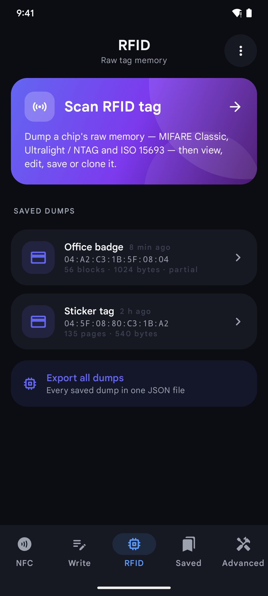 | 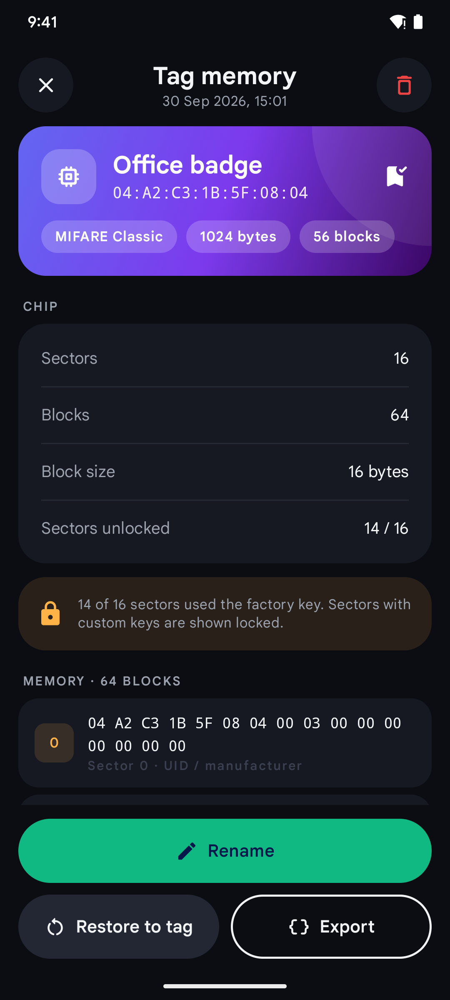 | 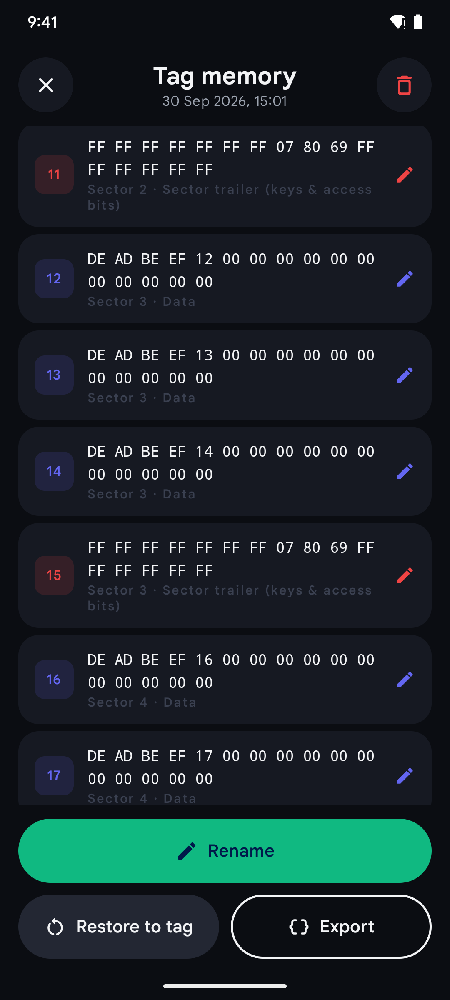 | 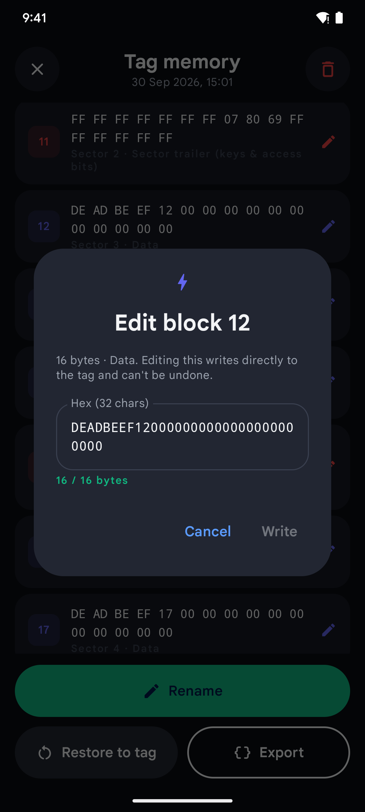 | 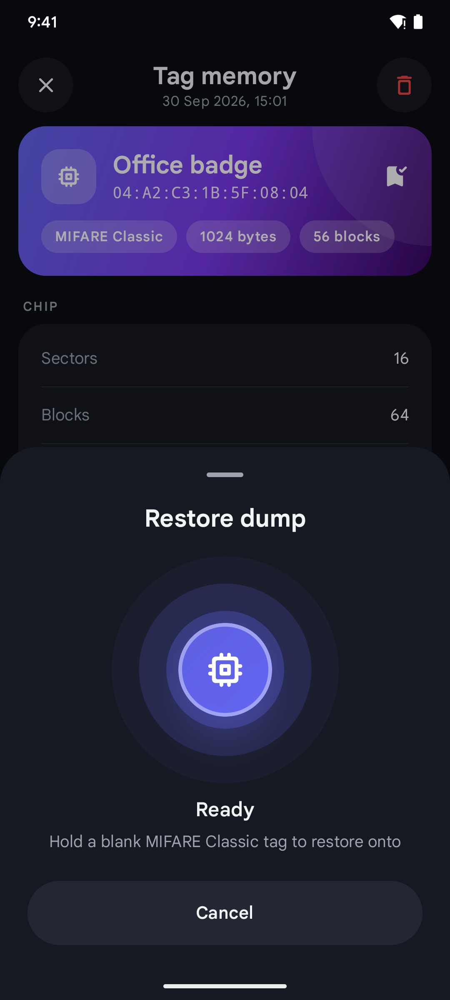 |

## Features

### 📡 Read
- Scan any tag from anywhere in the app — details open automatically
- Identifies the chip: **NTAG210/212/213/215/216**, **MIFARE Ultralight / EV1 / C**, **MIFARE Classic 1K/4K**, ISO 14443‑4, ISO 14443‑3B, **FeliCa**, ISO 15693
- UID, manufacturer (ISO/IEC 7816‑6), technologies, NDEF type, memory used / total
- Status: writable, lockable, NDEF‑formatable
- Chip info: ATQA, SAK, max transceive length, NXP `GET_VERSION` fields (vendor, product type, storage size…), MIFARE sectors/blocks, ISO‑DEP historical bytes, NfcB/NfcF/NfcV parameters
- Decodes NDEF records into readable content: links, text, phone, email, SMS, geo, **Wi‑Fi (WSC)**, **vCard**, Android app records, smart posters, MIME and external types
- **Simple / Advanced** views — Advanced shows TNF, type, and raw payload hex for every record
- One‑tap **Open** (links, calls, maps, apps) and **Copy** on every record

### ✍️ Write
17 record types, grouped by category:

| Category | Types |
|---|---|
| Web & Text | Web link, Text |
| Contact & Business | Business card (vCard), Phone, Email, SMS |
| Network & Automation | Wi‑Fi (WPA/WPA2/Open), Location, Launch app |
| Social | Instagram, LinkedIn, Telegram, WhatsApp, YouTube, X, Facebook, TikTok |

- Inline validation, live size estimate and "fits on NTAG213/215/216" hint
- Save records to **My Records** and write them again any time
- Long‑press to select several records and write them to **one tag** as a multi‑record message
- Formats blank `NdefFormatable` tags automatically on first write

### 🔖 Save & 📦 Export
- Save scanned tags with a custom name; rename or delete later
- Search your library by name, UID, chip type or content
- **Export JSON** — a single tag or your whole library (tags + records) via the system file picker
- **Import JSON** — merges an export back in, skipping duplicates
- Share / copy a human‑readable report of any tag

### 🛠 Tools
- **Copy a tag** — read a source tag, then write an identical copy to another (byte‑for‑byte NDEF clone)
- **Erase**, **Format**, and **Lock** (permanently read‑only, with confirmation)

### 💾 RFID — raw memory
A dedicated tab that reads and writes a chip's memory directly, below the NDEF layer.

- **Dump** the full memory of the HF families the phone can reach on its own:
  - **MIFARE Classic 1K/4K** — dumps each sector, trying the published factory/transport keys (`FFFFFFFFFFFF`, MAD, NFC Forum, …). Sectors that use a custom key are shown locked rather than skipped, so the dump is honest about what was read.
  - **Ultralight / NTAG 213/215/216** — every page, sized from `GET_VERSION`.
  - **ISO 15693** — reads blocks until the tag stops responding.
- **Colour‑coded hex grid** — each block/page shows its bytes, its sector, and its role (UID/manufacturer, sector trailer, lock/config, data).
- **Edit any writable block** in a hex editor with a live byte counter and validation. Writes go straight to the tag, with an extra warning on sector‑trailer blocks (keys & access bits).
- **Restore** a saved dump onto a blank tag of the same family — block 0 (UID) and locked pages are skipped automatically.
- **Save**, **rename**, **share** and **export/import JSON**, just like the NFC side.

> ⚠️ Raw writes are irreversible. A wrong sector‑trailer value can lock a MIFARE Classic sector for good, and writing Ultralight/NTAG pages 0–3 can brick a tag — MyNFC blocks those pages and warns on trailers, but always dump before you edit. Only use this on tags you own.

**What a phone can't do:** the NFC radio is 13.56 MHz only. It cannot read or write **125 kHz** tags (EM4100, HID Prox, T5577) or **UHF** tags — those need an external reader. It also can't recover a MIFARE Classic sector's custom key (no nested/darkside attack); only default‑key sectors are dumped.

### 🎨 Design
- Material 3, custom light & dark themes, edge‑to‑edge
- Animated radar scan, bottom‑sheet write flow with success/error states and haptics
- Reader mode keeps tags inside the app — no system chooser popping up while you work

## JSON export format

Exports are plain, pretty‑printed JSON — the same format the app stores internally, so nothing is lost on a round trip.

```jsonc
{
  "app": "MyNFC",
  "formatVersion": 1,
  "exportedAt": 1790596946515,
  "tags": [
    {
      "id": "…",
      "scannedAt": 1790000000000,
      "name": "Portfolio card",
      "uid": "04:A2:3B:1C:7F:61:80",
      "tagType": "NTAG215",
      "technologies": ["NfcA", "MifareUltralight", "Ndef"],
      "manufacturer": "NXP Semiconductors",
      "ndefType": "NFC Forum Type 2",
      "maxSize": 492,
      "usedSize": 58,
      "writable": true,
      "canMakeReadOnly": true,
      "formatable": false,
      "records": [
        {
          "kind": "URL",
          "tnf": 1,
          "tnfName": "NFC Well Known",
          "type": "U",
          "typeHex": "55",
          "idHex": "",
          "payloadHex": "046769746875622E636F6D2F…",
          "value": "https://github.com/…",
          "mimeType": null,
          "sizeBytes": 26
        }
      ],
      "chipInfo": [
        { "label": "ATQA", "value": "0x0044" },
        { "label": "SAK", "value": "0x00" }
      ]
    }
  ],
  "records": [
    {
      "id": "…",
      "type": "WIFI",
      "fields": { "ssid": "Cafe Guest", "auth": "WPA/WPA2", "password": "…" },
      "createdAt": 1790000000000,
      "updatedAt": 1790000000000
    }
  ]
}
```

Each record keeps its raw `tnf` / `typeHex` / `idHex` / `payloadHex`, so a saved or exported tag can be written back exactly as it was read.

RFID dumps export to a separate file with their own top‑level `dumps` array — each dump holds the chip info plus every memory block as hex:

```jsonc
{
  "app": "MyNFC",
  "formatVersion": 1,
  "exportedAt": 1790596946515,
  "dumps": [
    {
      "id": "…",
      "name": "Office badge",
      "family": "MIFARE_CLASSIC",
      "uid": "04:A2:C3:1B:5F:08:04",
      "tagType": "MIFARE Classic 1K",
      "totalBytes": 1024,
      "blockSize": 16,
      "sectorsRead": 14,
      "sectorsTotal": 16,
      "keysUsed": ["FFFFFFFFFFFF"],
      "blocks": [
        { "index": 0, "sector": 0, "dataHex": "04A2C31B5F08040003000000000000", "writable": false, "role": "manufacturer" },
        { "index": 8, "sector": 2, "dataHex": "00000000000000000000000000000000", "readable": false, "role": "data", "note": "Custom key" }
      ]
    }
  ]
}
```

> ⚠️ Wi‑Fi records store the password in plain text, both on the tag and in exports. RFID dumps contain the tag's full memory — which for access cards may include keys or credentials. Treat export files accordingly.

## Getting started

### Requirements
- A recent Android Studio that supports **AGP 8.13** (Narwhal or newer), with **JDK 17**
- An Android 8.0+ (API 26) device **with NFC** — emulators can't read tags
- A few NFC tags to play with (NTAG213/215/216 stickers are cheap and work great)

### Build & run

```bash
git clone https://github.com/YohannesTz/MyNFC.git
cd MyNFC
./gradlew installDebug
```

Or open the project in Android Studio and hit **Run**. No API keys or extra setup are needed.

### Release build

```bash
./gradlew assembleRelease
```

Configure a signing config in `app/build.gradle.kts` (or sign via **Build → Generate Signed Bundle / APK**) before publishing.

### Tests

The NDEF encode/decode logic is covered by instrumented tests (they use the real `android.nfc` classes, so they run on a device):

```bash
./gradlew connectedDebugAndroidTest
```

They check round trips for every record type, Wi‑Fi/vCard encoding, byte‑exact cloning, validation rules and JSON export/import, plus the raw‑write unit sizes per family.

Device‑independent logic (hex codec, models, RFID dump JSON) also runs as fast JVM unit tests, no device needed:

```bash
./gradlew testDebugUnitTest
```

## Architecture

Single‑activity Compose app, no DI framework — a small `AppContainer` wires everything together.

```
app/src/main/java/com/github/yohannestz/mynfc/
├── MainActivity.kt          # Enables NFC reader mode, forwards tags to NfcController
├── MyNfcApplication.kt      # AppContainer (repository + controller)
├── nfc/
│   ├── NfcController.kt     # Routes each tag: NDEF read/write/clone, or raw dump/write, by scan mode
│   ├── TagReader.kt         # Tag → ScannedTag (chip introspection, GET_VERSION, NDEF)
│   ├── TagWriter.kt         # NDEF write / erase / lock / format with friendly errors
│   ├── NdefParser.kt        # NdefRecord → readable NdefRecordInfo (and back, for cloning)
│   ├── RecordFactory.kt     # User records → NdefRecord, validation, summaries
│   ├── RawTagReader.kt      # Tag → RfidDump (Classic sectors w/ default keys, NTAG pages, ISO 15693)
│   ├── RawTagWriter.kt      # Write one block/page per family, with guard rails
│   ├── WifiCodec.kt         # Wi‑Fi Simple Configuration TLV encode/decode
│   └── Bytes.kt             # Hex helpers, IC manufacturer table
├── data/
│   ├── TagRepository.kt     # JSON‑file persistence exposed as StateFlows; import/export
│   └── model/               # ScannedTag, WriteRecord, RecordType, RfidDump, MemoryBlock, bundles
└── ui/
    ├── MyNfcAppRoot.kt      # Navigation (type‑safe routes), bottom bar, NFC + raw session sheets
    ├── home/ scan/ detail/ write/ saved/ tools/ rfid/ session/
    ├── components/          # Gradient cards, segmented toggle, radar pulse, info cards…
    ├── common/              # Icons/colors per record type, SAF export/import, intents
    └── theme/               # Colors, gradients, typography, shapes
```

**How a tap flows:** reader mode delivers the `Tag` on a binder thread → `NfcController` checks its sessions. A pending raw write wins first; otherwise, when idle, the controller reads the tag in the active **scan mode** — NDEF everywhere, or raw memory on the RFID tab — and emits it, and the UI navigates to the tag's details or its memory dump. A pending NDEF or raw write instead runs and drives the matching bottom sheet through progress → success/error.

### Tech stack

| | |
|---|---|
| UI | Jetpack Compose, Material 3, Material Icons Extended |
| Navigation | Navigation Compose 2.8 (type‑safe routes) |
| State | Kotlin Coroutines, StateFlow, `collectAsStateWithLifecycle` |
| Serialization | kotlinx.serialization (JSON) |
| NFC | `android.nfc` reader mode — `Ndef`, `NdefFormatable`, `NfcA/B/F/V`, `IsoDep`, `MifareClassic`, `MifareUltralight` |
| RFID | Raw block/page I/O via `MifareClassic`, `MifareUltralight`, `NfcA` (0x30/0xA2) and `NfcV` (ISO 15693 read/write) |
| Build | AGP 8.13, Kotlin 2.0.21, Gradle version catalog |

## Permissions & privacy

| Permission | Why |
|---|---|
| `android.permission.NFC` | Read and write tags |
| `android.permission.VIBRATE` | Haptic feedback when a write finishes |

MyNFC has **no internet permission**. Saved tags and records live in the app's private storage. Data only leaves the device when you export or share it yourself.

## Roadmap ideas

- [ ] Password‑protect NTAG21x tags (PWD_AUTH)
- [ ] User‑supplied MIFARE Classic key dictionary for raw dumps
- [ ] Home‑screen widget / quick settings tile to start a scan
- [ ] CSV export
- [ ] Localizations

## Contributing

Issues and pull requests are welcome. Please describe the tag model you tested with when reporting read/write bugs.

## License

MyNFC is released under the [MIT License](LICENSE).
